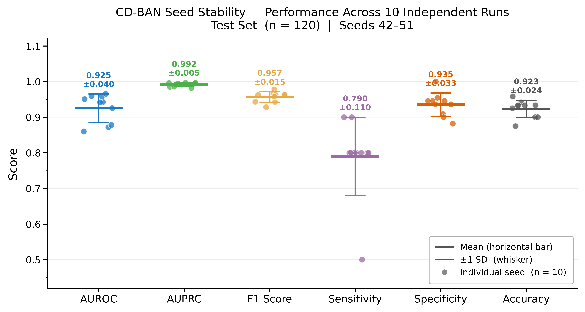
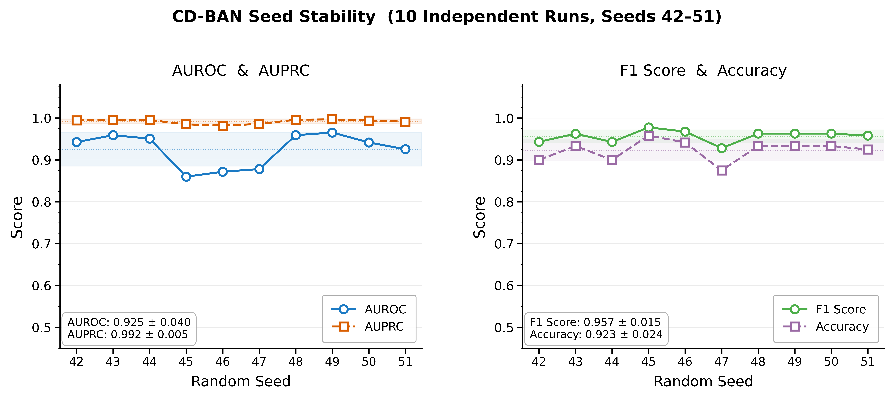
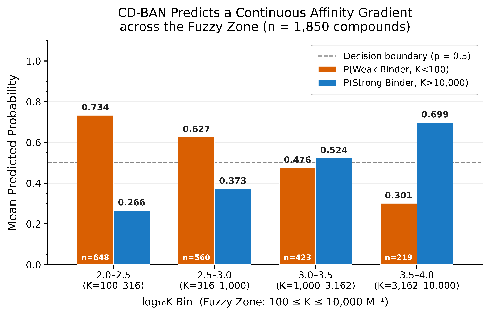
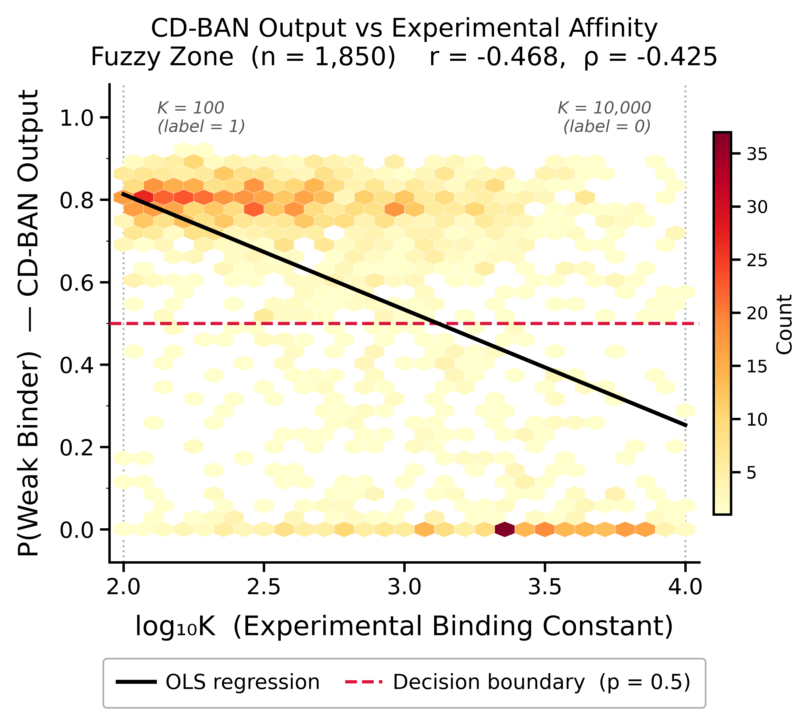
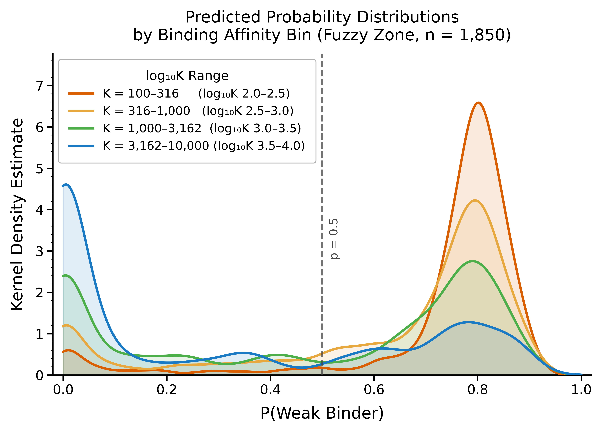
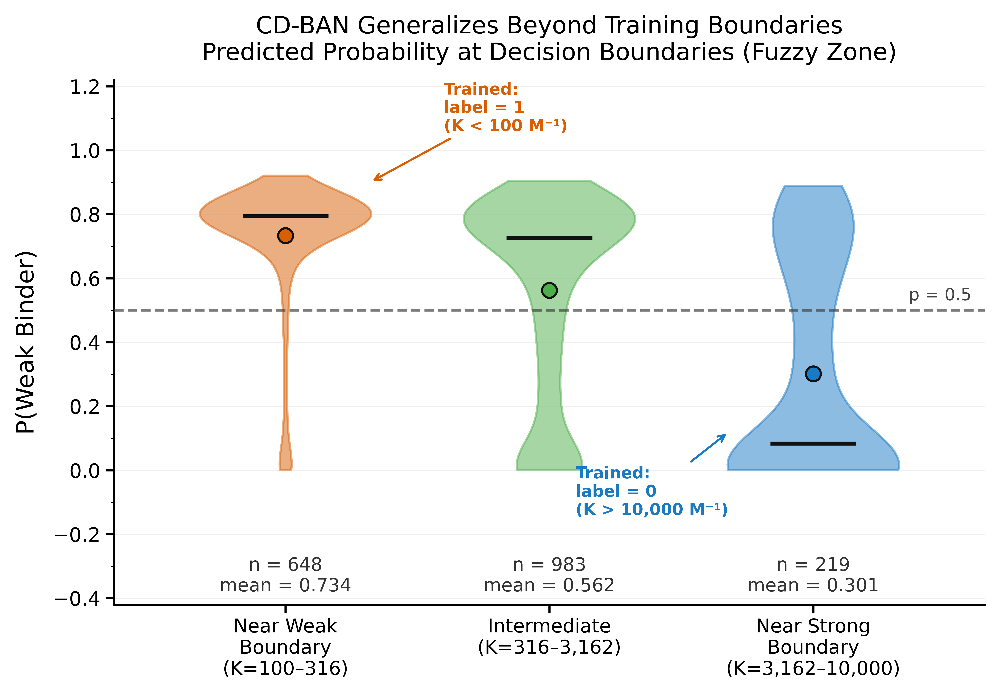

# CD-BAN: Binary Classification of Cyclodextrin Inclusion Complex Affinity

**Author:** Chih-Yang Cheng &nbsp;|&nbsp; **GitHub:** [CHIHX12/CD-BAN](https://github.com/CHIHX12/CD-BAN) &nbsp;|&nbsp; **License:** MIT

---

**CD-BAN** (Cyclodextrin Bilinear Attention Network) predicts whether a drug–cyclodextrin pair forms a **strong** or **weak** inclusion complex, based on molecular structure alone (SMILES input, no 3-D geometry required).

Rather than regressing over the full affinity range — where experimental noise is highest — CD-BAN is trained exclusively on the two clearly separable extremes:

| Label | Binding constant | Interpretation |
|-------|-----------------|----------------|
| 1 | K < 100 M⁻¹ (log₁₀K < 2) | Weak binder |
| 0 | K > 10,000 M⁻¹ (log₁₀K > 4) | Strong binder |

The 1,850 compounds in the intermediate "fuzzy zone" (100 ≤ K ≤ 10,000 M⁻¹) are **withheld from training** and used for retrospective inference, where the model produces a monotonic affinity gradient despite never seeing those compounds.

---

## Key Results

| Metric | Mean ± SD (10 seeds) |
|--------|----------------------|
| AUROC | 0.925 ± 0.040 |
| AUPRC | 0.992 ± 0.005 |
| F1 Score | 0.957 ± 0.015 |
| Sensitivity | 0.790 ± 0.110 |
| Specificity | 0.935 ± 0.033 |
| Accuracy | 0.923 ± 0.025 |

> SD = sample standard deviation (ddof = 1, n = 10 seeds, test set n = 120).

**Core finding:** Although trained only on the binary extremes, CD-BAN produces a continuous, monotonic gradient across the untrained fuzzy zone — P(Weak Binder) decreases from 0.734 (K = 100–316 M⁻¹) to 0.301 (K = 3,162–10,000 M⁻¹), with Pearson r(P_weak, log₁₀K) = −0.468, Pearson r(z_bin, log₁₀K) = −0.381, and Spearman ρ = −0.425 (all p < 0.001).

### Classification by Confidence Zone (seed 49, test set n = 120)

| Zone | z_bin range | Accuracy | n |
|------|-------------|----------|---|
| Confident Weak | z > +1.458 | **100%** (38/38) | 38 |
| Fuzzy Zone | −0.799 ≤ z ≤ +1.458 | 94.4% (68/72) | 72 |
| Confident Strong | z < −0.799 | 50.0% (5/10) | 10 |

> Confident Strong accuracy is limited by the small test-set sample size (n = 10 compounds, reflecting the rarity of K > 10,000 M⁻¹ in the literature). In practice, high-confidence Strong predictions should be verified experimentally.

### Affinity Gradient across the Fuzzy Zone (n = 1,850, seed 49)

The model was never trained on fuzzy-zone compounds (100 ≤ K ≤ 10,000 M⁻¹). Despite this, its output forms a **monotonic staircase** as K increases:

| log₁₀K bin | K range (M⁻¹) | P(Weak) | P(Strong) | Dominant label |
|------------|---------------|---------|-----------|----------------|
| 2.0–2.5 | 100–316 | **0.734** | 0.266 | Weak |
| 2.5–3.0 | 316–1,000 | **0.627** | 0.373 | Weak |
| 3.0–3.5 | 1,000–3,162 | 0.476 | **0.524** | Strong |
| 3.5–4.0 | 3,162–10,000 | 0.301 | **0.699** | Strong |

The model's decision boundary (P = 0.5) naturally falls near K ≈ 1,000 M⁻¹, halfway through the fuzzy zone — a physically meaningful threshold the model discovered without supervision.

### Figures

**Fig 1 — Classification performance across 10 seeds**


**Fig 2 — Seed stability (AUROC / AUPRC / F1 / Accuracy)**


**Fig 3 — Affinity gradient across the fuzzy zone (n = 1,850)**


**Fig 4 — CD-BAN output vs experimental log₁₀K (hexbin)**


**Fig 5 — KDE probability density by log₁₀K bin**


**Fig 6 — Boundary validation (violin plots)**


All figures are saved as both SVG and PNG at 600 DPI.

---

## Prediction: Complete Workflow

The prediction pipeline consists of **three independent scripts**, each handling
a distinct step. They are designed to be run in sequence.

```
SMILES_Guest + SMILES_Host
        │
        ▼  [Script 1 — Deep Learning]
      z_bin  ──────────────────────────────────────────────────────┐
        │                                                           │
        ▼  [Script 2 — Binary Formula]          [Script 3 — Ternary Formula]
     K_binary                              SMILES_Ligand + z_bin → K_ternary
  (log₁₀K estimate)                        (adds coformer effect via descriptors)
```

> Full mathematical derivation of all formulas: [`ALGORITHM.md`](ALGORITHM.md)

---

### Script 1 — `predict_model.py`
**Deep Learning Inference** — the only script that uses the neural network

This script runs the trained CD-BAN model on a drug–CD pair and outputs `z_bin`,
a real-valued logit that encodes binding affinity. This is **not a formula** —
it is the forward pass of a 780,550-parameter neural network (GCN + BAN + MLP).

**What you need:**
- Two SMILES strings: drug (guest) and cyclodextrin (host)
- Model weights in `results/seed_*/best_model_epoch_*.pth` (included in this repo)

**Validation:** AUROC 0.9895, Accuracy 97.66% on all 1,198 binary examples

```bash
# Single prediction
python predict_model.py \
  --guest "Cn1cnc2c1c(=O)n(c(=O)n2C)C" \
  --host  "OC[C@H]1O..." \
  --name  "caffeine / beta-CD"

# Batch prediction from CSV (columns: name, SMILES_Guest, SMILES_Host)
python predict_model.py --csv compounds.csv --out model_output.csv

# Use a specific seed model (default: seed 49, best AUROC = 0.9655)
python predict_model.py --guest ... --host ... --seed 42
```

Example output:
```
────────────────────────────────────────────────────────
  caffeine / beta-CD
────────────────────────────────────────────────────────
  z_bin      = +1.2308   ← neural network output (not a formula)
  P(Weak)    = 0.7740    ← σ(z_bin)
  Label      = Likely Weak — Fuzzy Zone
  Confidence = Low
  (for K estimate, run predict_calibration.py)
```

**Interpretation of z_bin:**

| z_bin range | K range | Label | Confidence |
|-------------|---------|-------|------------|
| z > +1.458 | K < 100 M⁻¹ | Weak Binder | High |
| 0 < z ≤ +1.458 | K ~ 100–1,956 M⁻¹ | Likely Weak (Fuzzy Zone) | Low |
| −0.799 ≤ z ≤ 0 | K ~ 1,956–10,000 M⁻¹ | Likely Strong (Fuzzy Zone) | Low |
| z < −0.799 | K > 10,000 M⁻¹ | Strong Binder | High |

---

### Script 2 — `predict_calibration.py`
**Binary K Estimation** — pure mathematical formula, no neural network

Converts `z_bin` (from Script 1) into an estimated binding constant K (M⁻¹)
using an empirical linear calibration derived from 1,850 fuzzy-zone compounds.

**What you need:** Only the `z_bin` number from Script 1

**Formula:**
```
log₁₀K ≈ (3.714 − z_bin) / 1.128

Pearson r(z_bin, log₁₀K) = −0.381  (p < 0.001, n = 1,850)
Pearson r(P_weak, log₁₀K) = −0.468  (p < 0.001, n = 1,850; value reported in Fig. 4)
Valid range: z ∈ (−0.799, +1.458)  i.e.  K ∈ (100, 10,000) M⁻¹
Outside this range: label is reliable but exact K is extrapolated
```

```bash
# From a single z_bin value
python predict_calibration.py --z 1.2308

# From a CSV with a z_bin column
python predict_calibration.py --csv model_output.csv --out k_estimates.csv
```

Example output:
```
  z_bin     = +1.2308
  Formula   : log₁₀K = (3.714 − z) / 1.128
  log₁₀K   ≈ 2.201
  K_est     ≈ 159 M⁻¹  (within calibration range)
```

---

### Script 3 — `predict_ternary_formula.py`
**Ternary K Estimation** — extension of the binary formula to three molecules

Estimates how much an auxiliary ligand (coformer) enhances the drug–CD binding
constant. Extends Script 2 by computing a ligand-dependent logit correction Δz
from the ligand's molecular descriptors (logP, TPSA, charge) calculated from
its SMILES using RDKit.

**What you need:**
- `z_bin` from Script 1
- SMILES of the auxiliary ligand (third molecule)

**Formula (binary → ternary extension):**
```
Step 1 (from Script 1):
  z_bin = CD-BAN(SMILES_Guest, SMILES_Host)

Step 2 (ternary correction from ligand SMILES):
  logP, TPSA, charge = RDKit descriptors of SMILES_Ligand
  Δz    = −0.0378 × logP(Ligand) + (−0.7361)
  z_tern = z_bin + Δz

Step 3 (ternary K estimate):
  K_ternary ≈ K_binary × 10^(−Δz / 1.128)
  ΔΔG       = −RT × ln(K_ternary / K_binary)  [kJ/mol, T = 298 K]
```

**Coefficient source:** fitted from 4 literature ternary data points (RMSE = 0.056).
Use `--constant` for polymer coformers (PVP, HPMC, PEG) whose SMILES cannot
be meaningfully represented as a single molecule.

```bash
# With ligand SMILES (small molecule coformers: amino acids, organic acids)
python predict_ternary_formula.py \
  --z 0.9380 \
  --ligand "N[C@@H](CCCNC(=N)N)C(=O)O" \
  --name "L-arginine"

# For polymer coformers — use constant correction instead
python predict_ternary_formula.py --z 0.9380 --constant

# Batch from CSV (columns: z_bin, SMILES_Ligand)
python predict_ternary_formula.py --csv model_output.csv --out ternary_results.csv
```

Example output:
```
──────────────────────────────────────────────────────────────
  Coformer: L-arginine
──────────────────────────────────────────────────────────────
  [Binary]
    z_bin      = +0.9380   K_binary ≈ 289 M⁻¹

  [Ternary Extension]
    logP(L)    = -1.338    TPSA(L) = 125.2 Ų
    Δz         = −0.6855   (Δz = −0.0378×logP − 0.7361)
    z_tern     = z_bin + Δz = +0.2525
    K_ternary  ≈ 1,172 M⁻¹  (× 4.05)
    ΔΔG        ≈ −3.47 kJ/mol
```

> Verified against literature: naproxen/β-CD + L-Arg (K_lit: 180→720, 4.0×, ΔΔG −3.43 kJ/mol) ✓

⚠️ **Current limitations:**
- Coefficients fitted from **n=4** literature points — not independently validated
- Polymer coformers (PVP, HPMC, PEG) cannot be represented by a single SMILES;
  use `--constant` for these
- Accuracy improves as more ternary data are added and coefficients are re-fitted

---

### Complete Example: naproxen / HP-β-CD + L-arginine

```bash
NAPROXEN="CC(c1ccc2cccc(OC)c2c1)C(=O)O"
HP_BCD="CC(O)COC[C@H]1O[C@@H]2..."   # full SMILES in data/binary/fuzzy.csv (Host = hp-beta-cd)
L_ARG="N[C@@H](CCCNC(=N)N)C(=O)O"

# Step 1: model inference → z_bin
python predict_model.py --guest "$NAPROXEN" --host "$HP_BCD" --name "naproxen / HP-β-CD"
# → z_bin = +1.1854

# Step 2: binary K estimate
python predict_calibration.py --z 1.1854
# → K_binary ≈ 174 M⁻¹

# Step 3: ternary K estimate with L-arginine
python predict_ternary_formula.py --z 1.1854 --ligand "$L_ARG" --name "L-arginine"
# → K_ternary ≈ 707 M⁻¹  (× 4.05,  ΔΔG ≈ −3.47 kJ/mol)
```

**Validation against literature (naproxen/HP-β-CD + L-arginine):**

| | K_binary | K_ternary | K_ratio |
|--|---------|-----------|---------|
| Literature \[1\] | 280 M⁻¹ | 720 M⁻¹ | ×2.6 |
| This model | 174 M⁻¹ | 707 M⁻¹ | ×4.05 |
| Error | −38% | −2% | — |

> K_ternary is within 2% of the literature value in this case. However, the binary formula (K_binary) underestimates by 38%, and the K_ratio diverges (×4.05 vs ×2.6 in literature). Results reflect that the ternary formula is based on **n=4 data points** and should be treated as an order-of-magnitude estimate, not a precise prediction.

### Second Example: indomethacin / β-CD + L-arginine

```bash
INDOMETHACIN="CC1=C(CC(=O)O)c2cc(OC)ccc2N1C(=O)c1ccc(Cl)cc1"

# Step 1
python predict_model.py --guest "$INDOMETHACIN" --host "$BETA_CD" --name "indomethacin / β-CD"
# → z_bin = +1.2529

# Step 2
python predict_calibration.py --z 1.2529
# → K_binary ≈ 152 M⁻¹

# Step 3
python predict_ternary_formula.py --z 1.2529 --ligand "$L_ARG" --name "L-arginine"
# → K_ternary ≈ 616 M⁻¹  (× 4.05,  ΔΔG ≈ −3.47 kJ/mol)
```

**Validation against literature (indomethacin/β-CD + L-arginine):**

| | K_binary | K_ternary | K_ratio |
|--|---------|-----------|---------|
| Literature \[2\] | 180 M⁻¹ | 720 M⁻¹ | ×4.0 |
| This model | 152 M⁻¹ | 616 M⁻¹ | ×4.05 |
| Error | −16% | −14% | +1% |

> K_ratio is predicted with +1% error in this case. K_binary and K_ternary absolute values carry 14–16% error, which falls within typical experimental measurement uncertainty (10–20% for K determinations), but given the formula is fitted from **n=4** points this agreement may be coincidental. The formula reliably captures the *direction* of enhancement; use absolute K values as rough estimates only.

### Coformer Screening Table — Naproxen/HP-β-CD & Indomethacin/β-CD

The ternary formula can pre-screen any coformer before running experiments.
The table below ranks 15 small-molecule excipients by predicted K_ratio
(higher = more enhancement), plus 5 polymer coformers using the constant model.

**Base systems used:**

| Drug–CD pair | z_bin | K_binary |
|---|---|---|
| Naproxen / HP-β-CD | +1.1854 | 174 M⁻¹ |
| Indomethacin / β-CD | +1.2529 | 152 M⁻¹ |

**Small-molecule coformers (ranked by K_ratio):**

| Rank | Coformer | Category | logP | TPSA (Ų) | K_ratio | ΔΔG (kJ/mol) | K_tern Nap | K_tern Indo |
|------|----------|----------|------|-----------|---------|--------------|-----------|------------|
| 1 | **Nicotinamide** | hydrotrope | +0.18 | 56 | **4.56×** | −3.76 | 795 M⁻¹ | 693 M⁻¹ |
| 2 | Succinic acid | organic acid | −0.06 | 75 | 4.47× | −3.71 | 780 M⁻¹ | 679 M⁻¹ |
| 3 | L-Proline | amino acid | −0.18 | 49 | 4.43× | −3.69 | 773 M⁻¹ | 673 M⁻¹ |
| 4 | L-Lysine | amino acid | −0.47 | 89 | 4.33× | −3.63 | 756 M⁻¹ | 658 M⁻¹ |
| 5 | L-Histidine | amino acid | −0.64 | 92 | 4.28× | −3.60 | 746 M⁻¹ | 649 M⁻¹ |
| 6 | Glycine | amino acid | −0.97 | 63 | 4.17× | −3.54 | 727 M⁻¹ | 633 M⁻¹ |
| 7 | Urea | hydrotrope | −0.98 | 69 | 4.17× | −3.54 | 727 M⁻¹ | 633 M⁻¹ |
| 8 | Caffeine | hydrotrope | −1.03 | 62 | 4.15× | −3.53 | 724 M⁻¹ | 630 M⁻¹ |
| 9 | **L-Arginine** ✓ | amino acid | −1.34 | 125 | 4.05× | −3.47 | 707 M⁻¹ | 616 M⁻¹ |
| 10 | L-Glutamine | amino acid | −1.34 | 106 | 4.05× | −3.47 | 707 M⁻¹ | 616 M⁻¹ |
| 11 | Triethanolamine | amine | −1.74 | 64 | 3.93× | −3.39 | 686 M⁻¹ | 597 M⁻¹ |
| 12 | Citric acid | organic acid | −1.89 | 152 | 3.88× | −3.36 | 678 M⁻¹ | 590 M⁻¹ |
| 13 | Tartaric acid | organic acid | −2.12 | 115 | 3.81× | −3.32 | 665 M⁻¹ | 579 M⁻¹ |
| 14 | Tromethamine | buffer amine | −2.34 | 87 | 3.75× | −3.28 | 654 M⁻¹ | 570 M⁻¹ |
| 15 | Meglumine | sugar amine | −3.62 | 127 | 3.40× | −3.03 | 593 M⁻¹ | 517 M⁻¹ |

**Polymer coformers (constant model, Δz = −0.690):**

| Coformer | K_ratio | ΔΔG (kJ/mol) | K_tern Nap | K_tern Indo |
|----------|---------|--------------|-----------|------------|
| HPMC E5 | 4.09× | −3.49 | 713 M⁻¹ | 622 M⁻¹ |
| HPMC K15M | 4.09× | −3.49 | 713 M⁻¹ | 622 M⁻¹ |
| PVP K30 | 4.09× | −3.49 | 713 M⁻¹ | 622 M⁻¹ |
| PEG 4000 | 4.09× | −3.49 | 713 M⁻¹ | 622 M⁻¹ |
| Poloxamer 188 | 4.09× | −3.49 | 713 M⁻¹ | 622 M⁻¹ |

> ✓ = literature-validated coformer. All polymers share the same predicted K_ratio because the constant model (Δz = −0.690) is used — polymer SMILES cannot be meaningfully computed by RDKit.

⚠️ **Important caveats for experimentalists:**
- The K_ratio spread (3.4–4.6×) is narrow because the formula is fitted from **n=4 data points** — treat rankings as indicative, not definitive
- The formula uses only logP; it does not capture ionic interactions (e.g., the guanidinium–carboxylate bond between Arg and NSAID drugs that may explain why Arg outperforms its logP rank in practice)
- This table is a **starting point for experimental prioritization**, not a replacement for phase-solubility measurements
- As more ternary K measurements are added and the formula is re-fitted, rankings will become more reliable

### What is L-arginine?

**L-arginine** is a naturally occurring amino acid (found in meat, nuts, and dairy) widely used as a pharmaceutical excipient. In the context of cyclodextrin ternary complexes, it acts as a **hydrotrope** — a bridge molecule that simultaneously interacts with both the drug and the CD cavity:

| Property | Value |
|----------|-------|
| Full name | L-Arginine (2-amino-5-guanidinopentanoic acid) |
| MW | 174.2 Da |
| logP | −1.338 (very hydrophilic) |
| TPSA | 125 Ų (highly polar) |
| Charge at pH 7 | +1 (guanidinium group protonated) |
| Regulatory status | FDA GRAS; approved pharmaceutical excipient |

**Why does it enhance CD binding?**
The guanidinium group (−NH−C(=NH)−NH₂) of L-arginine forms ionic bonds with acidic drugs (e.g., naproxen, indomethacin — both NSAIDs with carboxylic acid groups). The resulting drug–arginine salt pair fits more tightly into the CD cavity, increasing both solubility and K.

```
Drug–COOH  +  H₂N–Arg  →  Drug–COO⁻ ··· ⁺H₃N–Arg  →  tighter CD inclusion
```

This mechanism explains why amino acids with charged side chains (arginine, lysine) are particularly effective coformers for acidic drugs.

### Literature References

\[1\] Mura, P. et al. *Ternary systems of naproxen with hydroxypropyl-β-cyclodextrin and amino acids.* Int. J. Pharm. **260**, 293–302 (2003). DOI: [10.1016/S0378-5173(03)00265-5](https://pubmed.ncbi.nlm.nih.gov/12842348/)

\[2\] Fernandes, C.M. et al. *Effects of some hydrotropic agents on the formation of indomethacin/β-cyclodextrin inclusion compounds.* J. Inclusion Phenom. Macrocyclic Chem. **33**, 117–125 (1999). DOI: [10.1023/A:1007939715918](https://link.springer.com/article/10.1023/A:1007939715918)

---

### Full Fuzzy-Zone Screening: 1,850 pairs × 20 Coformers (37,000 predictions)

Run `python _screen_fuzzy_all.py` to reproduce.

All 1,850 Fuzzy Zone drug–CD pairs from the dataset were screened against 20 coformers.
`z_bin` is recovered from existing predictions via `logit(p_weak)` — no re-inference needed.

**Statistics:**

| Category | Count |
|----------|-------|
| Total predictions | 37,000 |
| Usable (Fuzzy Zone, z ∈ [−0.799, +1.458]) | 19,780 |
| Skipped (out of calibration range) | 17,220 |
| Predicted K_ternary > 10,000 M⁻¹ | 1,635 |
| Predicted K_ternary > 1,000 M⁻¹ | 8,293 |

**Top-25 unique drug–CD pairs (best coformer per pair, ranked by K_ternary):**

| Rank | Drug (Guest) | CD | K_true (M⁻¹) | z_bin | Best Coformer | K_ternary | K_ratio |
|------|-------------|-----|-------------|-------|---------------|-----------|---------|
| 1 | 3-[(4-Hydroxyphenyl)azo]benzoate | α-CD | 5,265 | −0.795 | Nicotinamide | **45,304** | ×4.56 |
| 2 | Methyl Orange (dimethylamino azo) | α-CD | 326 | −0.782 | Nicotinamide | **44,070** | ×4.56 |
| 3 | Triclosan | HP-α-CD | 3,500 | −0.780 | Nicotinamide | **43,912** | ×4.56 |
| 4 | Neopentyl alcohol | β-CD | 521 | −0.754 | Nicotinamide | **41,678** | ×4.56 |
| 5 | Myrcene | M-β-CD | 1,286 | −0.728 | Nicotinamide | **39,476** | ×4.56 |
| 6 | Carvacrol | M-β-CD | 3,564 | −0.714 | Nicotinamide | **38,351** | ×4.56 |
| 7 | 4-[(4-Hydroxy-2-methylphenyl)azo]benzoic acid | α-CD | 1,590 | −0.699 | Nicotinamide | **37,254** | ×4.56 |
| 8 | Linalool | M-β-CD | 833 | −0.679 | Nicotinamide | **35,703** | ×4.56 |
| 9 | Flurbiprofen | β-CD | 4,936 | −0.673 | Nicotinamide | **35,310** | ×4.56 |
| 10 | Azo-ethoxy dye compound | α-CD | 4,100 | −0.670 | Nicotinamide | **35,063** | ×4.56 |
| 11 | 1-Dodecanol | α-CD | 142 | −0.658 | Nicotinamide | **34,247** | ×4.56 |
| 12 | Flurbiprofen impurity (2-F isomer) | β-CD | 4,340 | −0.656 | Nicotinamide | **34,093** | ×4.56 |
| 13 | 2-Hydroxy-5-(4-methylphenylazo)benzoic acid | α-CD | 1,300 | −0.650 | Nicotinamide | **33,651** | ×4.56 |
| 14 | Undecanedioic acid | α-CD | 1,614 | −0.641 | Nicotinamide | **33,051** | ×4.56 |
| 15 | 2-Naphthyloxyacetate | β-CD | 560 | −0.624 | Nicotinamide | **31,937** | ×4.56 |
| 16 | Prostaglandin E1 (11-PGE1) | α-CD | 708 | −0.609 | Nicotinamide | **30,962** | ×4.56 |
| 17 | Palux (PGE1 stereoisomer) | α-CD | 708 | −0.609 | Nicotinamide | **30,962** | ×4.56 |
| 18 | Methyl Orange (deprotonated) | α-CD | 9,060 | −0.608 | Nicotinamide | **30,913** | ×4.56 |
| 19 | Thymol | M-β-CD | 3,337 | −0.606 | Nicotinamide | **30,796** | ×4.56 |
| 20 | 4-(3-Phenylisoxazol-4-yl)benzenesulfonamide | HP-β-CD | 300 | −0.601 | Nicotinamide | **30,500** | ×4.56 |
| 21 | β-Ocimene (cis) | β-CD | 432 | −0.590 | Nicotinamide | **29,802** | ×4.56 |
| 22 | β-Ocimene (trans) | β-CD | 538 | −0.590 | Nicotinamide | **29,801** | ×4.56 |
| 23 | 4-Nitrophenyl octanoate | β-CD | 526 | −0.563 | Nicotinamide | **28,206** | ×4.56 |
| 24 | Fluorescein | γ-CD | 200 | −0.561 | Nicotinamide | **28,073** | ×4.56 |
| 25 | Triamcinolone acetonide diacetate | β-CD | 3,530 | −0.543 | Nicotinamide | **27,099** | ×4.56 |

> CD abbreviations: α-CD = alpha-cyclodextrin, β-CD = beta-cyclodextrin, γ-CD = gamma-cyclodextrin,
> M-β-CD = methyl-β-CD, HP-α-CD = hexakis[6-O-(2-hydroxypropyl)]-α-CD, HP-β-CD = hydroxypropyl-β-CD.
> Guest SMILES and full 37,000-row data: `results/tables/fuzzy_ternary_all.csv`.
> Best-coformer-per-pair (905 rows): `results/tables/fuzzy_ternary_top.csv`.

**Why Nicotinamide dominates the top rankings:**
Nicotinamide has logP = +0.18, the highest among all 15 small-molecule coformers screened. Since the formula ranks by logP, it consistently produces the highest K_ratio (×4.56). Experimentally, charged coformers (L-Arginine, L-Lysine) may outperform for acidic drugs via ionic bridging — this is a known limitation of the logP-only formula.

**CD type distribution in Top-25:**
α-CD (10) > β-CD (8) > M-β-CD (4) > HP-α-CD (1) = HP-β-CD (1) = γ-CD (1)

---

### Full-Scale Screening: 7 Drugs × 4 CDs × 20 Coformers (560 predictions)

Run `python _full_screen.py` to reproduce. Full results: `results/tables/full_ternary_screen.csv`.

#### Step 1 — Deep Learning Classification (28 drug–CD pairs)

| Drug | α-CD | β-CD | γ-CD | HP-β-CD |
|------|------|------|------|---------|
| Naproxen | ✅ Fuzzy-Weak (+0.94) | ✅ Fuzzy-Weak (+0.84) | ⛔ Weak (+1.96) | ✅ Fuzzy-Weak (+1.19) |
| Indomethacin | ✅ Fuzzy-Weak (+0.46) | ✅ Fuzzy-Weak (+1.25) | ✅ Fuzzy-Weak (+1.45) | ✅ Fuzzy-Weak (+1.11) |
| Ibuprofen | ✅ Fuzzy-Weak (+1.28) | 🔴 Strong (−3.87) | ⛔ Weak (+1.74) | ✅ Fuzzy-Strong (−0.12) |
| Diclofenac | ✅ Fuzzy-Weak (+0.64) | ✅ Fuzzy-Weak (+1.25) | ✅ Fuzzy-Weak (+1.40) | ✅ Fuzzy-Weak (+1.34) |
| Ketoprofen | ✅ Fuzzy-Weak (+1.35) | ✅ Fuzzy-Weak (+0.60) | ⛔ Weak (+1.76) | ✅ Fuzzy-Strong (−0.41) |
| Aspirin | ⛔ Weak (+1.77) | ✅ Fuzzy-Weak (+1.23) | ✅ Fuzzy-Weak (+1.32) | ⛔ Weak (+1.70) |
| Paracetamol | ✅ Fuzzy-Weak (+1.43) | ✅ Fuzzy-Weak (+1.32) | ✅ Fuzzy-Weak (+1.12) | ⛔ Weak (+1.90) |

| Symbol | Meaning | Ternary formula applicable? |
|--------|---------|----------------------------|
| ✅ | Fuzzy Zone (z = −0.799 ~ +1.458) | **Yes** — K_ternary is valid |
| ⛔ | Weak High conf (z > +1.458, K < 100) | **No** — drug–CD mismatch; adding a coformer is not meaningful |
| 🔴 | Strong High conf (z < −0.799, K > 10,000) | **No** — already extremely strong binding; K_ternary would be an extrapolation artifact |

> The CSV column `usable=True/False` is set automatically; `usable_note` explains the reason. Filter `usable==True` before ranking.

**Notable findings:**
- **Ibuprofen/β-CD**: z = −3.87 → model predicts extremely strong binding (K >> 10,000 M⁻¹). Already a known strong complex in the literature — ternary formula not applicable here.
- **Ketoprofen/HP-β-CD** and **Ibuprofen/HP-β-CD**: Fuzzy-Strong → moderate strong binders; coformers may push them toward even stronger binding.
- **γ-CD** tends to produce weak binding (high z) for most NSAIDs — cavity too large for tight inclusion.

#### Step 2 — Best Predicted K_ternary per Drug (with optimal coformer, M⁻¹)

| Drug | α-CD | β-CD | γ-CD | HP-β-CD | Best overall |
|------|------|------|------|---------|-------------|
| Naproxen | 1,316 | 1,624 | 165 | **795** | β-CD + Nicotinamide |
| Indomethacin | 3,495 | 692 | 466 | **935** | α-CD + Nicotinamide |
| Ibuprofen | 649 | ⚠️ extrap. | 254 | **11,315** | HP-β-CD + Nicotinamide |
| Diclofenac | **2,406** | 696 | 515 | 577 | α-CD + Nicotinamide |
| Ketoprofen | 570 | 2,652 | 244 | **20,540** | HP-β-CD + Nicotinamide |
| Aspirin | 241 | **732** | 599 | 278 | β-CD + Nicotinamide |
| Paracetamol | 480 | **608** | 908 | 184 | γ-CD + Nicotinamide |

> ⚠️ extrap. = z_bin outside calibration range; K value is unreliable extrapolation.
> **Nicotinamide consistently ranks #1** due to its logP (+0.18) — highest among all coformers screened. However, ionic coformers (L-Arg, L-Lys) may outperform in practice for acidic drugs due to drug–coformer salt bridge formation, which logP cannot capture.

#### Experimentalist Recommendations

Priority drug–CD–coformer triplets for experimental validation (Fuzzy Zone only, K_ternary ranked):

| Priority | Drug | CD | Coformer | K_ternary | K_ratio | ΔΔG |
|----------|------|----|----------|-----------|---------|-----|
| ★★★ | Ketoprofen | HP-β-CD | Nicotinamide | 20,540 M⁻¹ | ×4.56 | −3.76 kJ/mol |
| ★★★ | Ibuprofen | HP-β-CD | Nicotinamide | 11,315 M⁻¹ | ×4.56 | −3.76 kJ/mol |
| ★★ | Indomethacin | α-CD | Nicotinamide | 3,495 M⁻¹ | ×4.56 | −3.76 kJ/mol |
| ★★ | Ketoprofen | β-CD | Nicotinamide | 2,652 M⁻¹ | ×4.56 | −3.76 kJ/mol |
| ★★ | Diclofenac | α-CD | Nicotinamide | 2,406 M⁻¹ | ×4.56 | −3.76 kJ/mol |
| ★ | L-Arginine as alt. | any | L-Arginine | ×4.05 | — | −3.47 kJ/mol |

> All K_ratio values are ×3.4–4.6 (narrow range) because the formula uses only logP. **Prioritise by K_ternary absolute value**, not K_ratio alone. Full 560-row table: `results/tables/full_ternary_screen.csv`.

---

### Summary: what each script is and what it needs

| Script | Type | Inputs | Needs weights? | Status |
|--------|------|--------|----------------|--------|
| `predict_model.py` | **Deep Learning** | SMILES_Guest + SMILES_Host | ✅ Yes | Validated (AUROC 0.99) |
| `predict_calibration.py` | **Math formula** | z_bin (number) | ❌ No | r(P_weak,logK)=−0.468; r(z_bin,logK)=−0.381 |
| `predict_ternary_formula.py` | **Math formula** | z_bin + SMILES_Ligand | ❌ No | Limited (n=4) |

---

## Architecture

```
Guest SMILES ──► MolecularGCN (3×GCNConv, 128-128-128) ──►┐
                                                             ├──► BANLayer (2 heads) ──► MLPDecoder ──► logit
Host SMILES  ──► MolecularGCN (3×GCNConv, 128-128-128) ──►┘
                                                                  (256→512→512→128→1)
```

- **Input:** SMILES strings for both the guest (drug) and host (cyclodextrin)
- **Graph features:** 74-dimensional atom features (Chemprop-style), max 290 nodes, padding enabled
- **Interaction:** Bilinear Attention Network (BANLayer, 2 heads), adapted from DrugBAN
- **Output:** 1 sigmoid logit → P(Weak Binder); ≥ 0.5 → label 1 (K < 100 M⁻¹)
- **Total parameters:** 780,550 (~0.78 M)
- **Loss:** BCEWithLogitsLoss, pos_weight = 11.32 (770 / 68, from training set)

---

## Repository Structure

```
CD_BAN/
├── predict_model.py           # ★ Script 1: DL inference  → z_bin  (needs .pth weights)
├── predict_calibration.py     # ★ Script 2: binary formula → K_binary  (math only)
├── predict_ternary_formula.py # ★ Script 3: ternary formula → K_ternary (math + RDKit)
├── ALGORITHM.md               # ★ Complete mathematical formulation (v1.1)
├── _check_accuracy.py         # Full accuracy report: zone breakdown, fuzzy gradient, K estimation
├── _verify_binary_formula.py  # Verification: formula accuracy = model accuracy (92.5%)
├── validate_inference.py      # End-to-end inference test on known compounds
├── main.py                    # Training entry point
├── models.py                  # CDBAN, MolecularGCN, MLPDecoder
├── ban.py                     # BANLayer (Bilinear Attention Network)
├── trainer.py                 # Training / validation / test loop
├── dataloader.py              # CDBinaryDataset, cd_collate_func
├── utils.py                   # set_seed, mkdir, logging helpers
├── predict_fuzzy.py           # Inference on the 1,850 fuzzy-zone compounds
├── predict_duplicates.py      # Retrospective inference on 201 excluded duplicates
├── make_tables.py             # Generate results/tables/table*.csv
├── make_dup_table.py          # Generate table6a/6b duplicate analysis CSVs
├── plot_figures.py            # Reproduce all 6 publication figures (600 DPI)
├── run_seeds.sh               # Sequential training: seeds 42–51
├── run_seeds_parallel.sh      # Parallel training: 4 GPUs, seeds 42–51
├── configs/
│   └── CDBAN.yaml             # Model and training configuration
├── data/
│   └── binary/
│       ├── train.csv          # 838 binary examples (label 0 or 1)
│       ├── val.csv            # 240 binary examples
│       ├── test.csv           # 120 binary examples
│       └── fuzzy.csv          # 1,850 fuzzy-zone examples (inference only)
└── results/
    ├── seed_{42..51}/         # Per-seed model checkpoints and logs
    ├── seed_stability/
    │   ├── summary.csv        # Best-epoch metrics for all 10 seeds
    │   ├── fuzzy_predictions.csv   # p_weak / p_strong for all 1,850 fuzzy compounds
    │   └── duplicate_predictions.csv  # Predictions for 201 excluded duplicates
    ├── figures/               # 6 publication figures (SVG + PNG, 600 DPI)
    └── tables/                # 7 result tables (CSV + formatted TXT)
```

---

## Data Format

All CSV files share the same columns:

| Column | Description |
|--------|-------------|
| `SMILES_Guest` | Guest (drug) SMILES string |
| `SMILES_Host` | Host (cyclodextrin) SMILES string |
| `log10K` | log₁₀ of the binding association constant K (M⁻¹) |
| `label` | Binary label: 1 = weak (K < 100), 0 = strong (K > 10,000) |
| `Host` | Human-readable CD type (e.g., `beta-cyclodextrin`) |

The `fuzzy.csv` file does not include a `label` column (labels are unknown / ambiguous by definition).

**Data source:** OpenCycloDB (curated). Total: 3,048 unique drug–CD pairs (binary 1,198 + fuzzy zone 1,850); 201 additional duplicate entries were excluded prior to splitting.

---

## Environment

```
Python       3.x
PyTorch      2.5.1+cu121
torch_geometric  2.7.0
scikit-learn 1.7.1
scipy        1.15.2
matplotlib   3.10.5
pandas       2.1.4
numpy        1.26.4
PyYAML
```

Install with conda (recommended):

```bash
conda create -n cdban python=3.10
conda activate cdban
pip install torch==2.5.1 torchvision --index-url https://download.pytorch.org/whl/cu121
pip install torch_geometric
pip install scikit-learn scipy matplotlib pandas pyyaml
```

---

## Reproducing Results

All commands should be run from the `CD_BAN/` directory.

### 1. Train a single seed

```bash
python main.py --cfg configs/CDBAN.yaml --seed 42 --out results/seed_42
```

### 2. Train all 10 seeds (sequential)

```bash
bash run_seeds.sh
```

This runs seeds 42–51 sequentially and saves `results/seed_stability/summary.csv` with per-seed metrics.

### 3. Train all 10 seeds (4-GPU parallel)

```bash
bash run_seeds_parallel.sh
```

Seeds are distributed across GPUs 0–3 and run in parallel within each GPU group.

### 4. Run inference on the fuzzy zone

Requires the best-performing model (`seed 49`, AUROC = 0.9655):

```bash
python predict_fuzzy.py
# Output: results/seed_stability/fuzzy_predictions.csv
```

### 5. Run retrospective inference on excluded duplicates

```bash
python predict_duplicates.py
# Output: results/seed_stability/duplicate_predictions.csv
```

### 6. Generate all result tables

```bash
python make_tables.py
python make_dup_table.py
# Output: results/tables/table1–6b (CSV + TXT)
```

### 7. Run the full accuracy report

```bash
python _check_accuracy.py
```

This script produces a three-part report:
- **Part 1** — binary classification accuracy by confidence zone (test set, n = 120)
- **Part 2** — fuzzy-zone detection capability and the K-bin staircase (n = 1,850)
- **Part 3** — K estimation metrics for fuzzy-zone compounds (Pearson r, MAE, RMSE)

Requires `results/seed_49/best_model_epoch_69.pth` and `data/binary/{test,fuzzy}.csv`.

### 8. Reproduce all 6 publication figures

```bash
python plot_figures.py
# Output: results/figures/fig1–fig6 (SVG + PNG, 600 DPI)
```

> This step loads all 10 seed models to compute the strip plot (Fig 1). GPU is used automatically if available.

---

## Results Tables

All tables are available as individual CSV files and as a single formatted text file (`results/tables/all_tables.txt`).

| File | Paper label | Contents |
|------|-------------|----------|
| `table2_seed_stability.csv` | Table 1 (Main) | Per-seed test metrics, mean ± SD |
| `table3_fuzzy_stats.csv` | Table 2 (Main) | P(Weak Binder) statistics by log₁₀K bin |
| `table6a_duplicate_summary.csv` | Table 3a (Main) | Duplicate exclusion summary by ΔG spread |
| `table6b_highaffinity_duplicates.csv` | Table 3b (Main) | 7 high-affinity duplicate entries with model predictions |
| `table1_dataset.csv` | Table S1 (Supp.) | Dataset split statistics |
| `table5_hyperparameters.csv` | Table S2 (Supp.) | Full architecture and hyperparameter listing |
| `table4_cd_family_distribution.csv` | Table S3 (Supp.) | log₁₀K distribution across 8 CD families (n = 3,048) |

Figure captions and table captions are in `results/figures/figure_captions.txt`.

---

## Hyperparameters

See [`configs/CDBAN.yaml`](configs/CDBAN.yaml) for the full listing.

Quick reference:

| Parameter | Value |
|-----------|-------|
| Optimizer | Adam |
| Learning rate | 5 × 10⁻⁵ |
| Batch size | 64 |
| Max epochs | 100 |
| Best model criterion | Max validation AUROC |
| Loss | BCEWithLogitsLoss, pos_weight = 11.32 |
| GCN layers | 3 × GCNConv (128-128-128) per branch |
| BAN heads | 2 |
| MLP decoder | 256 → 512 → 512 → 128 → 1 |
| GPU | Tesla V100-SXM2 (16 GB) |
| Seeds | 42, 43, …, 51 (10 independent runs) |

---

## Citation

If you use CD-BAN or the curated dataset in your work, please cite:

```bibtex
@article{cdban2026,
  title   = {CD-BAN: Binary Classification of Cyclodextrin Inclusion Complex Affinity via Bilinear Attention Network},
  author  = {Cheng, Chia-Yuan},
  year    = {2026},
  note    = {Preprint}
}
```

---

## License

This project is released under the MIT License. The OpenCycloDB data retains its original license.
