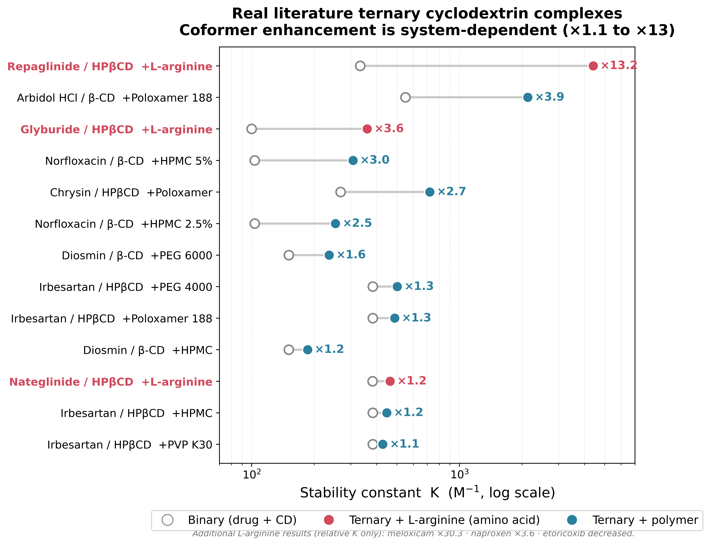

# CD-BAN: Cyclodextrin Bilinear Attention Network

**Paper:** Bilinear cross-attention networks implicitly supervise continuous thermodynamic gradients in supramolecular screening

**Authors:**
Chih-Yang Cheng¹, Yi-Huan Wu²\*, Feng-Yin Li¹\*

¹ Department of Chemistry, National Chung Hsing University, Taichung 402, Taiwan  
² Department of Chemistry, R.O.C. Military Academy, Kaohsiung, Taiwan  

\*Corresponding authors: Yi-Huan Wu (m1090008@rocma.edu.tw), Feng-Yin Li (feng64@nchu.edu.tw)

**License:** MIT

---

## Abstract

Predicting non-covalent host-guest binding affinities solely from 2D molecular graphs remains a fundamental challenge in representation learning. Here, we introduce CD-BAN, a dual-branch graph neural network that utilizes a bilinear cross-attention mechanism to explicitly model the structural complementarity of drug-cyclodextrin inclusion complexes, entirely bypassing the need for 3D geometries or handcrafted descriptors. Trained exclusively on a binary classification objective to distinguish thermodynamic extremes (strong: K > 10,000 M⁻¹ versus weak: K < 100 M⁻¹) across 1,198 labeled pairs, CD-BAN achieves robust performance (AUROC = 0.925 ± 0.040). Strikingly, the model's latent space spontaneously organizes into a continuous affinity gradient for entirely out-of-distribution data. Evaluated on 1,850 withheld intermediate-affinity compounds (100 ≤ K ≤ 10,000 M⁻¹), the network's output logit yields a highly significant monotonic ranking (τ = −0.289, p < 10⁻⁷⁵), demonstrating that discrete binary supervision can implicitly capture continuous thermodynamic principles. Leveraging this emergent property through heuristic boundary calibration, we successfully prioritize 37,000 uncharacterized drug-excipient ternary combinations. Ultimately, this work highlights how attention-based networks can uncover continuous physical laws from discrete empirical limits, providing a highly scalable framework for supramolecular screening.

---

## What it does

CD-BAN predicts whether a drug-cyclodextrin pair forms a **strong** (K > 10,000 M⁻¹) or **weak** (K < 100 M⁻¹) inclusion complex from SMILES strings alone, with no 3D geometry required.

| Label | Condition | Meaning |
|-------|-----------|---------|
| 0 | K > 10,000 M⁻¹ | Strong binder |
| 1 | K < 100 M⁻¹ | Weak binder |

---

## Key Results (10 seeds, test set n = 120)

| Metric | Mean ± SD |
|--------|-----------|
| AUROC | 0.925 ± 0.040 |
| AUPRC | 0.992 ± 0.005 |
| F1 | 0.957 ± 0.015 |
| Accuracy | 0.923 ± 0.025 |

---

## Installation

```bash
conda create -n cdban python=3.10
conda activate cdban
pip install torch==2.5.1 --index-url https://download.pytorch.org/whl/cu121
pip install torch_geometric scikit-learn scipy matplotlib pandas pyyaml prettytable tqdm rdkit
```

---

## Training

```bash
# Single seed
python main.py --cfg configs/CDBAN.yaml --seed 42 --out results/seed_42

# All 10 seeds (sequential)
bash run_seeds.sh

# All 10 seeds (4-GPU parallel)
bash run_seeds_parallel.sh
```

---

## Prediction

Three scripts, run in order:

### Step 1 - Model inference (deep learning)
```bash
python predict_model.py \
  --guest "Cn1cnc2c1c(=O)n(c(=O)n2C)C" \
  --host  "OC[C@H]1O[C@@H]2..." \
  --name  "caffeine / beta-CD"
```
Output: `z_bin` (logit), `P(Weak)`, confidence label

### Step 2 - Estimate K (binary formula)
```bash
python predict_calibration.py --z 1.2308
```
Formula: `log₁₀K ≈ (3.714 − z_bin) / 1.128`

### Step 3 - Ternary K estimate (with coformer)
```bash
python predict_ternary_formula.py \
  --z 0.9380 \
  --ligand "N[C@@H](CCCNC(=N)N)C(=O)O" \
  --name "L-arginine"
```
Formula: `Δz = −0.0378 × logP(coformer) − 0.7361`

> Full mathematical derivation: [`ALGORITHM.md`](ALGORITHM.md)

---

## Ternary Screening

The ternary formula (Step 3 above) was used to screen drug–CD pairs against 15 small-molecule coformers and rank candidates by predicted enhancement. Two outputs are shown below.

> **⚠️ Status of the ternary formula.** The descriptor-based `Δz` formula (Step 3) is **exploratory only**. As shown below against real literature data, coformer enhancement of CD binding is strongly system-dependent and cannot be predicted from `logP` alone. The candidate ranking is illustrative, not a validated quantitative prediction.

### Predicted candidates (illustrative)


Each row shows the drug structure, the cyclodextrin, a candidate coformer, and the binding constant before (drug + CD) and after adding the coformer, as produced by the `Δz` formula. Only predictions whose `z_tern` stays inside the calibration range (`−0.799 ≤ z_tern ≤ +1.458`) are kept. **These predicted K values should be treated as a hypothesis generator, not measured affinities** (see validation below).

Data: [`results/tables/ternary_top10_predicted.csv`](results/tables/ternary_top10_predicted.csv) (full SMILES in the `SMILES_Guest` column).

### Real literature ternary data



To ground the ternary problem in measured data, we compiled **16 drug–CD–coformer systems** from the literature with reported binary and ternary stability constants (13 with absolute K values; all with DOIs):

| Drug / CD | Coformer | K_binary | K_ternary | Ratio | Ref (DOI) |
|-----------|----------|---------:|----------:|------:|-----------|
| Repaglinide / HPβCD | L-arginine | 333 | 4,407 | **×13.2** | 10.1007/s10847-015-0559-y |
| Arbidol / β-CD | Poloxamer 188 | 550 | 2,134 | ×3.9 | 10.3390/ph14050411 |
| Glyburide / HPβCD | L-arginine | 100 | 360 | ×3.6 | 10.3390/pharmaceutics13071099 |
| Chrysin / HPβCD | Poloxamer | 268 | 720 | ×2.7 | 10.3390/ph15121525 |
| Norfloxacin / β-CD | HPMC (5%) | 103 | 307 | ×3.0 | 10.3390/pharmaceutics13071099 |
| Irbesartan / HPβCD | PEG 4000 | 383 | 502 | ×1.3 | 10.1016/j.jddst.2021.102964 |
| Nateglinide / HPβCD | L-arginine | 382 | 464 | ×1.2 | 10.3390/pharmaceutics13071099 |
| Irbesartan / HPβCD | PVP K30 | 383 | 428 | ×1.1 | 10.1016/j.jddst.2021.102964 |

Full table (16 systems): [`results/tables/ternary_literature_real.csv`](results/tables/ternary_literature_real.csv).

**Key finding — the coformer effect is system-dependent.** The same coformer (L-arginine) ranges from *reducing* K (etoricoxib, DOI 10.1080/03639040802220292) to ×1.2 (nateglinide), ×3.6 (glyburide, naproxen), ×13 (repaglinide), and ×30 (meloxicam, DOI 10.2478/v10007-008-0029-9). This enhancement does **not** correlate with `logP`, which is why a single descriptor formula is insufficient and a data-driven ternary model is left as future work.

---

## Architecture

```
Guest SMILES ──► MolecularGCN (3×GCNConv 128-128-128) ──►┐
                                                           ├──► BANLayer (2 heads) ──► MLP ──► logit
Host SMILES  ──► MolecularGCN (3×GCNConv 128-128-128) ──►┘
```

- Atom features: 74-dim (element, degree, valence, hybridization, aromaticity, H count)
- BANLayer: bilinear attention, adapted from DrugBAN
- Loss: BCEWithLogitsLoss, pos_weight = 11.32
- Parameters: 780,550

---

## Attention Analysis

BANLayer attention aggregated over all label=0 (strong-binding) guests,
collapsed to 11 glucopyranose chemical positions (C1, C2, C3, C4, C5,
O5, C6, O6, O2, O3, O-bridge).

```bash
# Bar charts (600 dpi) + region-color PyMOL scripts
python generate_all_cd_aggregate.py

# Crystal structure PyMOL visualization (downloads PDB from RCSB automatically)
python generate_crystal_pymol.py
```

Output:
- `results/aggregate_attention/` - 600 dpi bar charts (PNG/SVG) + PML scripts for all 4 CD types
- `results/crystal_pymol/` - crystal structure PDB + attention-colored PML + 1920x1080 renders

Crystal structure sources:
- alpha-CD: PDB 4FEM (chain B)
- beta-CD:  PDB 1DMB (chain B)
- gamma-CD: PDB 2ZYK (chain E)
- HP-beta-CD: RDKit ETKDGv3 (no clean crystal available)

PyMOL color: blue = low attention (C2, C3), red = high attention (O5, O2, O3, Ob)

```bash
cd results/crystal_pymol
pymol beta_CD_crystal.pml    # auto-renders 1920x1080 PNG
```

---

## Repository Structure

```
CD_BAN/
├── main.py                      # Training entry point
├── models.py                    # CDBAN, MolecularGCN, MLPDecoder
├── trainer.py                   # Training loop
├── dataloader.py                # Dataset and collate function
├── ban.py                       # BANLayer
├── utils.py                     # Utilities
├── predict_model.py             # Step 1: DL inference -> z_bin
├── predict_calibration.py       # Step 2: binary K estimate
├── predict_ternary_formula.py   # Step 3: ternary K estimate
├── predict_fuzzy.py             # Inference on fuzzy-zone compounds
├── predict_duplicates.py        # Inference on excluded duplicates
├── plot_figures.py              # Reproduce all publication figures
├── plot_attention.py            # BANLayer attention heatmap
├── generate_all_cd_aggregate.py # Aggregate attention bar charts + PML scripts
├── generate_crystal_pymol.py    # Crystal structure PyMOL visualization
├── ALGORITHM.md                 # Mathematical formulation
├── configs/CDBAN.yaml           # Hyperparameters
├── data/binary/                 # train / val / test / fuzzy CSV files
└── results/
    ├── seed_49/                 # Model weights (best_model_epoch_69.pth)
    ├── aggregate_attention/     # Bar charts (600 dpi) + PML + RDKit PDB
    └── crystal_pymol/           # Crystal PDB + PML + 1920x1080 renders
```

---

## Dataset

| Split | N | Condition |
|-------|---|-----------|
| Train | 838 | K < 100 or K > 10,000 M⁻¹ |
| Val | 240 | same |
| Test | 120 | same |
| Fuzzy (inference only) | 1,850 | 100 ≤ K ≤ 10,000 M⁻¹ |

Source: OpenCycloDB (curated). Fuzzy-zone compounds are withheld from training and used only for retrospective inference.

---

## Citation

```bibtex
@article{cdban2026,
  title   = {Bilinear cross-attention networks implicitly supervise continuous thermodynamic gradients in supramolecular screening},
  author  = {Cheng, Chih-Yang and Wu, Yi-Huan and Li, Feng-Yin},
  year    = {2026},
  note    = {Preprint}
}
```
